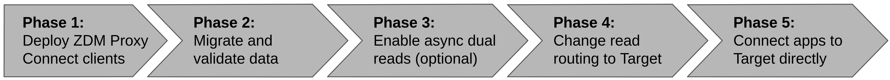

<!-- TOP -->
<div class="top">
  
  <div class="scenario-title-section">
    <span class="scenario-title">Zero Downtime Migration Lab</span>
    <span class="scenario-subtitle">ℹ️ For technical support, please contact us via <a href="mailto:aleksandr.volochnev@datastax.com">email</a> or <a href="https://dtsx.io/aleks">LinkedIn</a>.</span>
  </div>
</div>

<!-- NAVIGATION -->
<div id="navigation-top" class="navigation-top">
 <a href='command:katapod.loadPage?[{"step":"step10"}]' 
   class="btn btn-dark navigation-top-left">⬅️ Back
 </a>
<span class="step-count">Epilogue: cleanup</span>
 <a href='command:katapod.loadPage?[{"step":"finish"}]' 
    class="btn btn-dark navigation-top-right">Next ➡️
  </a>
</div>

<!-- CONTENT -->

<div class="step-title">Epilogue: cleanup</div>



### _🎯 Goal: cleanly deleting all resources that are no longer needed now that the migration is over._

If your ZDM infrastructure was running on disposable hosts, such as
cloud instances that you can delete with one click), you could do so now.

In this exercise, however, all containers (and related Docker objects)
are running on the same host: for the sake of completeness, let us explicitly
dispose of all resources not needed anymore.

Remove the `zdm-ansible-container` with:

```bash
### host
docker rm -f zdm-ansible-container
```

Then remove the proxy container itself:

```bash
### host
docker rm -f zdm-proxy-container
```

Get rid of all of the monitoring stack (including a volume that comes with the containers):

```bash
### host
docker rm -f \
  zdm-grafana-container \
  zdm-prometheus-container \
  zdm-node-exporter-container
docker volume rm zdm-prometheus-metrics-volume
```

Finally, **destroy Origin** (gulp!). In this case it is easy,
it's just a single-node Cassandra cluster. _Note: in an
actual production setup, do not take this step lightly
(by the way, it's a bit more than one node)!_

```bash
### host
VOLUME_CASSANDRA_ORIGIN_1=`docker inspect cassandra-origin-1 | jq -r '.[].Mounts[] | select( .Type=="volume" ).Name'`
docker rm -f cassandra-origin-1
docker volume rm ${VOLUME_CASSANDRA_ORIGIN_1}
```

### _🗒️ Well, this is really the end. Time to wrap it up._

<!-- NAVIGATION -->
<div id="navigation-bottom" class="navigation-bottom">
 <a href='command:katapod.loadPage?[{"step":"step10"}]'
   class="btn btn-dark navigation-bottom-left">⬅️ Back
 </a>
 <a href='command:katapod.loadPage?[{"step":"finish"}]'
    class="btn btn-dark navigation-bottom-right">Next ➡️
  </a>
</div>
