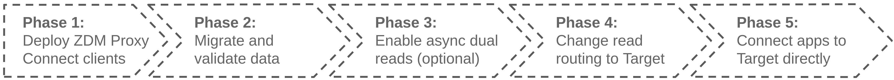
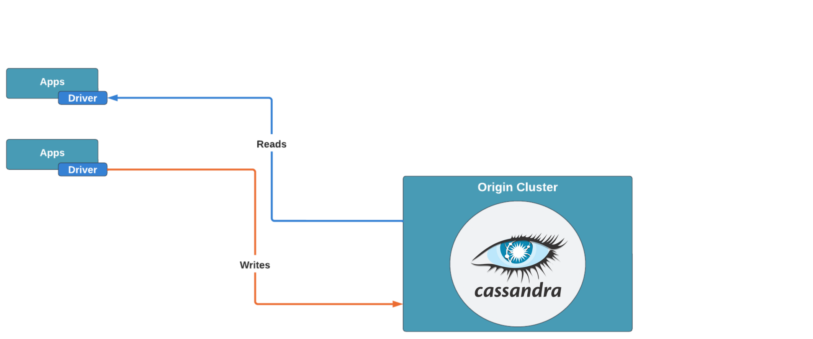

<!-- TOP -->
<div class="top">
  
  <div class="scenario-title-section">
    <span class="scenario-title">Zero Downtime Migration Lab</span>
    <span class="scenario-subtitle">ℹ️ For technical support, please contact us via <a href="mailto:aleksandr.volochnev@datastax.com">email</a> or <a href="https://dtsx.io/aleks">LinkedIn</a>.</span>
  </div>
</div>

<!-- NAVIGATION -->
<div id="navigation-top" class="navigation-top">
  <a href='command:katapod.loadPage?[{"step":"intro"}]' 
    class="btn btn-dark navigation-top-left">⬅️ Back
  </a>
  <span class="step-count">Step 1</span>
  <a href='command:katapod.loadPage?[{"step":"step2_astra_ui"}]' 
    class="btn btn-dark navigation-top-right"
    style="margin-left: 8px;"
  >Next (Astra UI) ➡️
  </a>
  <a href='command:katapod.loadPage?[{"step":"step2_astra_cli"}]' 
    class="btn btn-dark navigation-top-right">Next (astra-cli) ➡️
  </a>
</div>

<!-- CONTENT -->

<div class="step-title">Before the migration</div>



### _🎯 Goal: making sure that Origin is ready and that there is a sample client application reading and writing on it._

Wait for the message "Origin database provisioned" on the the first console ("host-console").

Now check Origin:

```bash
### host
docker exec \
  -it cassandra-origin-1 \
  cqlsh -u cassandra -p cassandra \
  -e "SELECT * FROM my_application_ks.user_status WHERE user='eva';"
```

It is now time to prepare the dotenv file so that the connection
parameters for Origin are known to the sample application (a simple REST API in our case).

To do so, first check the addresses you need by running:

```bash
### host
. ./scenario_scripts/find_addresses.sh
```

Now, in the "api-console" terminal, copy the provided template and edit it, inserting, for the time being,
just the IP address of the Origin seed, `CASSANDRA_SEED_IP`
_(Note: to save the file and quit `nano` once modified: Ctrl-X, then Y, then Enter)_:

```bash
### api
cd client_application
cp .env.sample .env
nano +3,17 .env
```

Start the API in such a way that it reads from Origin:

```bash
### api
CLIENT_CONNECTION_MODE=CASSANDRA uvicorn api:app
```

Test the API with a few calls: first check Eva's status with:

```bash
### client
curl -XGET localhost:8000/status/eva | jq
```

Then write a new status:

```bash
### client
curl -XPOST localhost:8000/status/eva/New | jq
```

Try the read again. Even better, you can keep a separate browser tab open
and refresh whenever you want to check: run the following command
(_specific to this learning environment_)

```bash
### host
# PLEASE CHECK YOUR POPUP BLOCKER ONCE YOU RUN THIS!
gp preview --external `gp url 8000`/status/eva
```

Now start a loop that periodically inserts a new status (you'll keep it running
througout the practice)

```bash
### client
while true; do
  NEW_STATUS="ItIs_`date +'%H-%M-%S'`";
  echo -n "Setting status to ${NEW_STATUS} ... ";
  curl -s -XPOST -o /dev/null "localhost:8000/status/eva/${NEW_STATUS}";
  echo "done. Sleeping a little ... ";
  sleep 20;
done
```

### _🗒️ You have a working application backed by a Cassandra cluster. Time to start preparing for a migration!_



_🧭 You can choose whether to proceed to next step either using the Astra
Web UI or using a CLI in the console (_except for the DB creation part, which is on the Astra UI anyway_).
The result will be the same (just keep in mind that for the
CLI route you'll use an Astra database auth token with slightly higher
permissions than strictly
[needed for the migration](https://docs.datastax.com/en/astra-serverless/docs/migrate/create-target.html#_create_an_astra_db_serverless_cluster)
itself)._

_↔️ Please choose how you would like to perform the next step (setting up Target):_

<!-- NAVIGATION -->
<div id="navigation-top" class="navigation-top">
  <a href='command:katapod.loadPage?[{"step":"intro"}]' 
    class="btn btn-dark navigation-top-left">⬅️ Back
  </a>
  <a href='command:katapod.loadPage?[{"step":"step2_astra_ui"}]' 
    class="btn btn-dark navigation-top-right"
    style="margin-left: 8px;"
  >Next (Astra UI) ➡️
  </a>
  <a href='command:katapod.loadPage?[{"step":"step2_astra_cli"}]' 
    class="btn btn-dark navigation-top-right">Next (astra-cli) ➡️
  </a>
</div>
