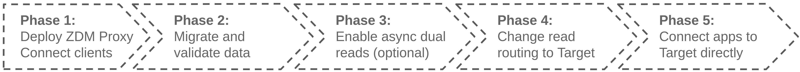
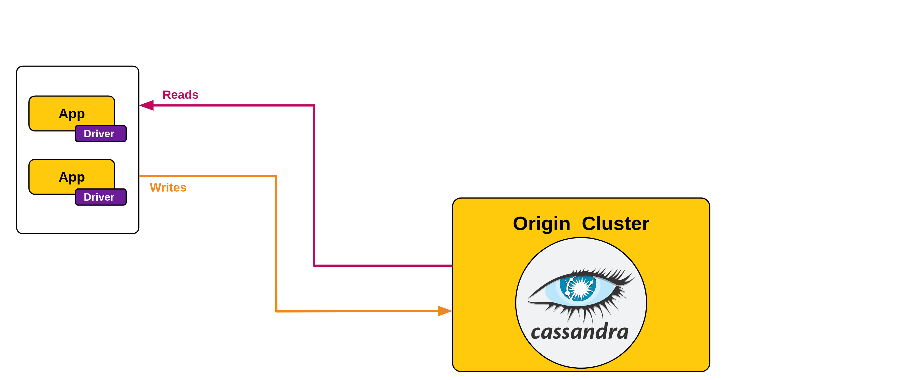

<!-- TOP -->
<div class="top">
  
  <div class="scenario-title-section">
    <span class="scenario-title">Zero Downtime Migration Lab</span>
    <span class="scenario-subtitle">ℹ️ For technical support, please contact us via <a href="mailto:aleksandr.volochnev@datastax.com">email</a> or <a href="https://dtsx.io/aleks">LinkedIn</a>.</span>
  </div>
</div>

<!-- NAVIGATION -->
<div id="navigation-top" class="navigation-top">
  <a href='command:katapod.loadPage?[{"step":"intro"}]' 
    class="btn btn-dark navigation-top-left">⬅️ Back
  </a>
  <span class="step-count">Step 1</span>
  <a href='command:katapod.loadPage?[{"step":"step2_astra_ui"}]' 
    class="btn btn-dark navigation-top-right"
    style="margin-left: 8px;"
  >Next (Astra UI) ➡️
  </a>
  <a href='command:katapod.loadPage?[{"step":"step2_astra_cli"}]' 
    class="btn btn-dark navigation-top-right">Next (astra-cli) ➡️
  </a>
</div>

<!-- CONTENT -->

<div class="step-title">Preliminary step: Origin and sample application</div>



#### _🎯 Goal: making sure that Origin is ready and that there is a sample client application reading and writing on it._

**Note**: please wait for message _"Ready for Step 1"_ on the
the first console ("host-console") before proceeding.

Before starting a production Zero Downtime Migration, there are several preliminary steps
that must be carefully completed (see [Documentation](https://docs.datastax.com/en/astra-serverless/docs/migrate/preliminary-steps.html));
with the exception of the actual provisioning of the Target database, however, in this hands-on lab these will be taken for granted. They are:

- [Feasibility checks](https://docs.datastax.com/en/astra-serverless/docs/migrate/feasibility-checklists.html);
- [Deployment and infrastructure considerations](https://docs.datastax.com/en/astra-serverless/docs/migrate/deployment-infrastructure.html);
- [Creation of the Target environment](https://docs.datastax.com/en/astra-serverless/docs/migrate/create-target.html) **(next step in this lab)**;
- [Assessment of the rollback options](https://docs.datastax.com/en/astra-serverless/docs/migrate/rollback.html).

In this spirit, you will simply check the Origin database and make sure that
the sample client application, which accesses it, is properly running.
First have a look at the contents of the table in Origin with this CQL query
(sample rows have been inserted already):

```bash
### host
docker exec \
  -it cassandra-origin-1 \
  cqlsh -u cassandra -p cassandra \
  -e "SELECT * FROM zdmapp.user_status WHERE user='eva';"
```

The parameters to connect to Origin are pre-filled in file `client_application/.env`,
so that you can immediately launch the client application
(an API to handle "status updates" by various "users").
The following command instructs it to use Origin:

```bash
### api
cd /workspace/zdm-scenario-katapod/client_application/
CLIENT_CONNECTION_MODE=CASSANDRA uvicorn api:app
```

Test the API with a few calls: first check Eva's last three status updates, to compare with the `SELECT` results above:

```bash
### host
curl -XGET "localhost:8000/status/eva?entries=3" | jq
```

_Note: you can customize the `entries` query parameter in all API GET calls to your needs._

Then write a new status:

```bash
### client
curl -XPOST "localhost:8000/status/eva/New" | jq
```

Try the read again and check the output to see the new status:

```bash
### host
curl -XGET localhost:8000/status/eva | jq
```

The next API invocations will usually manipulate the output to make it more compact, as in:

```bash
### host
curl -s -XGET "localhost:8000/status/eva?entries=3" | jq -r '.[] | "\(.when)\t\(.status)"'
```

You can even open a separate browser tab with the output
and refresh it whenever you want to check.
The following command (_specific to this learning environment_) opens it:

```bash
### host
API_URL="`gp url 8000`/status/eva?entries=5"
echo "Opening ${API_URL} ..."
gp preview --external ${API_URL}
```

_(Depending on your browser and popup-blocker settings, chances are no tab will open at this point. In that case, simply grab the URL output on your console and manually point a new tab to that address.)_

Now start a loop that periodically inserts a new (timestamped) status for Eva.
You'll keep it running througout the practice, to put the "zero-downtime" aspect to test:

```bash
### client
while true; do
  NEW_STATUS="ModeCassandra_`date +'%H-%M-%S'`";
  echo -n "Setting status to ${NEW_STATUS} ... ";
  curl -s -XPOST -o /dev/null "localhost:8000/status/eva/${NEW_STATUS}";
  echo "done. Sleeping a little ... ";
  sleep 20;
done
```

Feel free to play with the GET endpoint to see the trickle of new rows in the API response.

#### _🗒️ You have a working application backed by a Cassandra cluster. Time to start preparing for a migration!_



_🧭 You can choose whether to proceed to next step either using the Astra
Web UI or using a CLI in the console (_except for the DB creation part, which is on the Astra UI anyway_).
The result will be the same -- just keep in mind that for the
CLI route you'll use an Astra database auth token with slightly higher
permissions than strictly
[needed for the migration](https://docs.datastax.com/en/astra-serverless/docs/migrate/create-target.html#_create_an_astra_db_serverless_cluster)
itself._

_↔️ Please choose how you would like to perform the next step (setting up Target):_

<!-- NAVIGATION -->
<div id="navigation-top" class="navigation-top">
  <a href='command:katapod.loadPage?[{"step":"intro"}]' 
    class="btn btn-dark navigation-top-left">⬅️ Back
  </a>
  <a href='command:katapod.loadPage?[{"step":"step2_astra_ui"}]' 
    class="btn btn-dark navigation-top-right"
    style="margin-left: 8px;"
  >Next (Astra UI) ➡️
  </a>
  <a href='command:katapod.loadPage?[{"step":"step2_astra_cli"}]' 
    class="btn btn-dark navigation-top-right">Next (astra-cli) ➡️
  </a>
</div>
