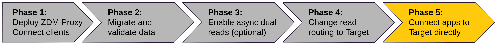

<!-- TOP -->
<div class="top">
  
  <div class="scenario-title-section">
    <span class="scenario-title">Zero Downtime Migration Lab</span>
    <span class="scenario-subtitle">ℹ️ For technical support, please contact us via <a href="mailto:academy@datastax.com">email</a>.</span>
  </div>
</div>

<!-- NAVIGATION -->
<div id="navigation-top" class="navigation-top">
 <a href='command:katapod.loadPage?[{"step":"step9"}]' 
   class="btn btn-dark navigation-top-left">⬅️ Back
 </a>
<span class="step-count">Step 10</span>
 <a href='command:katapod.loadPage?[{"step":"cleanup"}]' 
    class="btn btn-dark navigation-top-right">Next ➡️
  </a>
</div>

<!-- CONTENT -->

<div class="step-title">Phase 5: connect directly to Target</div>



#### _🎯 Goal: instructing your client application to connect directly to Target, in order to later dispose of the whole ZDM infrastructure._

Until now we could bail out any time.
After the following change **we are effectively committing to the migration**,
with the app directly writing to Astra DB and finally
skipping the ZDM (and Origin) altogether.

This step is very simple. The following command stops the running API, then
restarts it by passing the appropriate setting to it:

```bash
### {"terminalId": "api", "macrosBefore": ["ctrl_c"]}
# A Ctrl-C to stop the running process ... followed by:
CLIENT_CONNECTION_MODE=ASTRA_DB uvicorn api:app
```

Once again, run the following, which changes the messages in the API-writing loop accordingly:

```bash
### {"terminalId": "client", "macrosBefore": ["ctrl_c"]}
while true; do
  NEW_STATUS="ModeAstra_`date +'%H-%M-%S'`";
  echo -n "Setting status to ${NEW_STATUS} ... ";
  curl -s -XPOST -o /dev/null "localhost:8000/status/eva/${NEW_STATUS}";
  echo "done. Sleeping a little ... ";
  sleep 20;
done
```

The API will work exactly as before and the migration is complete.
At this point, you can destroy the whole ZDM infrastructure (see next step).

To ensure the application is still working as expected, you can launch yet
another read request, looking for the "ModeAstra..." status messages:

```bash
### host
curl -s -XGET "localhost:8000/status/eva?entries=2" | jq -r '.[] | "\(.when)\t\(.status)"'
```

Conversely, on Origin, you will **not** see the latest
entries inserted, confirming that database has really disappeared
from the picture:

```bash
### host
docker exec \
  -it cassandra-origin-1 \
  cqlsh -u cassandra -p cassandra \
  -e "SELECT * FROM zdmapp.user_status WHERE user='eva' LIMIT 5;"
```

#### _🏆 Congratulations: the migration is complete._

_You managed to perform_
_a Zero Downtime Migration, making sure all data (past and present)_
_is kept consistent, with the ability to keep read performance_
_under scrutiny at all times, and a full suite of dashboards to inspect_
_every aspect of the migration process. The only thing left to do_
_is cleaning up: hit "Next" to complete this exercise._


#### 🔎 Monitoring suggestion

The proxy has now been put aside: you can check with, the
proxy instance graphs, that no requests are going through it anymore.

<!-- NAVIGATION -->
<div id="navigation-bottom" class="navigation-bottom">
 <a href='command:katapod.loadPage?[{"step":"step9"}]'
   class="btn btn-dark navigation-bottom-left">⬅️ Back
 </a>
 <a href='command:katapod.loadPage?[{"step":"cleanup"}]'
    class="btn btn-dark navigation-bottom-right">Next ➡️
  </a>
</div>
