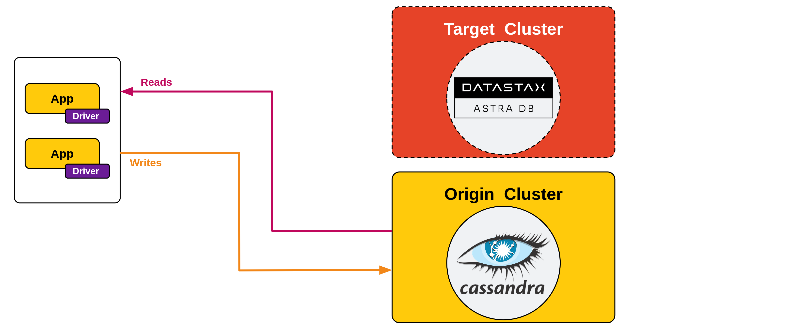

<!-- TOP -->
<div class="top">
  
  <div class="scenario-title-section">
    <span class="scenario-title">Zero Downtime Migration Lab</span>
    <span class="scenario-subtitle">ℹ️ For technical support, please contact us via <a href="mailto:academy@datastax.com">email</a>.</span>
  </div>
</div>

<!-- NAVIGATION -->
<div id="navigation-top" class="navigation-top">
  <a title="Back" href='command:katapod.loadPage?[{"step":"step1"}]' 
    class="btn btn-dark navigation-top-left">⬅️ Back
  </a>
  <span class="step-count">Step 2 (astra-cli)</span>
  <a title="Next" href='command:katapod.loadPage?[{"step":"step3"}]' 
    class="btn btn-dark navigation-top-right">Next ➡️
  </a>
</div>

<!-- CONTENT -->

<div class="step-title">Preliminary step: set up Target</div>


#### _🎯 Goal: creating the Target database (Astra DB instance) and verifying it is ready for the migration._

_The Target database you are going to create is an **Astra DB** instance.
This managed solution, built on Apache Cassandra™, frees you from
worrying about operations; moreover, it is a serverless architecture
that scales with your needs, avoiding unnecessary resource usage.
If you don't have an Astra account, [go create one](https://astra.datastax.com/): the **Free Tier**
can cover much, much more I/O and storage than what's needed for
this migration exercise._

**Note**: you are going to make use of the `astra-cli` [utility](https://docs.datastax.com/en/astra-classic/docs/astra-cli/introduction.html)
to perform most of the required steps from the console.
However, database creation and generation of an associated token are still done on the Astra Web UI:

- Create your [Astra account](https://astra.datastax.com/) if you haven't yet.
- Create a database called `zdmtarget` with a `zdmapp` keyspace ([detailed instructions](https://awesome-astra.github.io/docs/pages/astra/create-instance/)). _for the Free Tier accounts, stick to the GCP cloud provider and choose a region without the "lock" icon). The DB will be ready to use in 2-3 minutes._
- Get a **"Database Administrator"** database token from the Astra UI and store it in a safe place ([detailed instructions](https://awesome-astra.github.io/docs/pages/astra/create-token/#c-procedure)). _You will need it a few times throughout the exercise. For the migration process, a "R/W User" token would suffice, but a more powerful token is needed for the `astra-cli` automation._

<details class="katapod-details"><summary>I want to re-use an Astra DB instance I already have</summary>

If you already have a database (likely with a name other than `zdmtarget`)
and want to use it, that's no problem at all! Just make sure you
[create a new keyspace](https://awesome-astra.github.io/docs/pages/astra/faq/#add-a-keyspace-to-an-existing-database) 
called `zdmapp` in your database and, in case the DB is in the "hibernated" state, please
[resume it](https://awesome-astra.github.io/docs/pages/astra/resume-db/) before moving to next step.

All you have to do then is replacing the name `zdmtarget` with your database
the few times it appears in the console commands for the rest of this scenario.

</details>

Once this part is done, you can proceed in the "host" console.
The Astra CLI is preinstalled for you: configure it with

```bash
### host
astra setup
```

and provide the `AstraCS:...` part of the token when prompted.

Have the CLI prepare a `.env` file, useful to later retrieve the database ID _(edit the database name if different from `zdmtarget`)_:

```bash
### host
astra db create-dotenv zdmtarget -k zdmapp -d /workspace/zdm-scenario-katapod
```

During creation of this file, the "secure connect bundle" zipfile, needed by
the sample application, has been downloaded as well at this path:

```bash
### host
grep ASTRA_DB_SECURE_BUNDLE_PATH /workspace/zdm-scenario-katapod/.env
```

_Take a note of the zipfile full path, you'll need it later for the example API._

Finally, your Target database needs a schema matching the one in Origin.
Check the contents of the script file with

```bash
### host
cat /workspace/zdm-scenario-katapod/target_config/target_schema.cql
```

and then execute it on the newly-created Astra DB instance _(editing the database name if different from `zdmtarget`)_:

```bash
### host
cd /workspace/zdm-scenario-katapod/
astra db cqlsh zdmtarget -f target_config/target_schema.cql
```

#### _🗒️ Your brand new database is created and has the right schema. Now you can start setting up the ZDM process, instructing it to use Astra DB as target._



<!-- NAVIGATION -->
<div id="navigation-bottom" class="navigation-bottom">
  <a title="Back" href='command:katapod.loadPage?[{"step":"step1"}]'
    class="btn btn-dark navigation-bottom-left">⬅️ Back
  </a>
  <a title="Next" href='command:katapod.loadPage?[{"step":"step3"}]'
    class="btn btn-dark navigation-bottom-right">Next ➡️
  </a>
</div>
