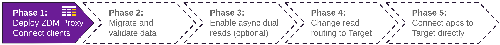

<!-- TOP -->
<div class="top">
  
  <div class="scenario-title-section">
    <span class="scenario-title">Zero Downtime Migration Lab</span>
    <span class="scenario-subtitle">ℹ️ For technical support, please contact us via <a href="mailto:aleksandr.volochnev@datastax.com">email</a> or <a href="https://dtsx.io/aleks">LinkedIn</a>.</span>
  </div>
</div>

<!-- NAVIGATION -->
<div id="navigation-top" class="navigation-top">
  <a href='command:katapod.loadPage?[{"step":"step1"}]' 
    class="btn btn-dark navigation-top-left">⬅️ Back
  </a>
  <span class="step-count">Step 2 (Astra UI)</span>
  <a href='command:katapod.loadPage?[{"step":"step3"}]' 
    class="btn btn-dark navigation-top-right">Next ➡️
  </a>
</div>

<!-- CONTENT -->

<div class="step-title">Phase 1a: Set up Target</div>



#### _🎯 Goal: creating the Target database (Astra DB instance) and verifying it is ready for the migration._

_The Target database you are going to create is an **Astra DB** instance.
This managed solution, built on Apache Cassandra™, frees you from
worrying about operations; moreover, it is a serverless architecture
that scales with your needs, avoiding unnecessary resource usage.
If you don't have an Astra account, [go create one](https://astra.datastax.com/): the **Free Tier**
can cover much, much more I/O and storage than what's needed for
this migration exercise._

**Note**: you are going to execute the following steps within the Astra Web interface.

- Create your [Astra account](https://astra.datastax.com/) if you haven't yet.
- Create a database called `zdmtarget` with a `zdmapp` keyspace ([detailed instructions](https://awesome-astra.github.io/docs/pages/astra/create-instance/)). _for the Free Tier accounts, stick to the GCP cloud provider and choose a region without the "lock" icon). The DB will be ready to use in 2-3 minutes._
- Get a **"R/W User"** database token from the Astra UI and store it in a safe place ([detailed instructions](https://awesome-astra.github.io/docs/pages/astra/create-token/#c-procedure)). _You will need it a few times throughout the exercise._
- Locate and note down the "Database ID" for your Astra DB instance. This is seen on your Astra dashboard, next to your database name ([detailed instructions](https://awesome-astra.github.io/docs/pages/astra/faq/#where-should-i-find-a-database-identifier)).
- Find the "download secure-connect-bundle" option in the Connect tab for your database (`Connect` ⇒ `Drivers` ⇒ `"Native"` ⇒ _any language_ ⇒ `"Download Bundle"` ⇒ _pick Region_ ⇒ `CURL`) and paste the resulting `curl` command in the "host-console" here ([detailed instructions](https://awesome-astra.github.io/docs/pages/astra/download-scb/#c-procedure)). _Take a note of the full path to the downloaded bundle zipfile, you'll need it for the example API_.
- In the Web CQL Console on the Astra UI (it's a tab in your database dashboard), paste the following script to create a schema mirroring the one on Origin:

```cql
### {"execute": false}
CREATE TABLE IF NOT EXISTS zdmapp.user_status (
  user    TEXT,
  when    TIMESTAMP,
  status  TEXT,
  PRIMARY KEY ((user), when)
) WITH CLUSTERING ORDER BY (when DESC);
```

#### _🗒️ Your brand new database is created and has the right schema. Now you can start setting up the ZDM process, instructing it to use Astra DB as target._


<!-- NAVIGATION -->
<div id="navigation-bottom" class="navigation-bottom">
  <a href='command:katapod.loadPage?[{"step":"step1"}]'
    class="btn btn-dark navigation-bottom-left">⬅️ Back
  </a>
  <a href='command:katapod.loadPage?[{"step":"step3"}]'
    class="btn btn-dark navigation-bottom-right">Next ➡️
  </a>
</div>
