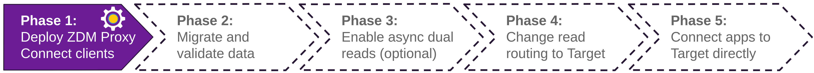

<!-- TOP -->
<div class="top">
  
  <div class="scenario-title-section">
    <span class="scenario-title">Zero Downtime Migration Lab</span>
    <span class="scenario-subtitle">ℹ️ For technical support, please contact us via <a href="mailto:aleksandr.volochnev@datastax.com">email</a> or <a href="https://dtsx.io/aleks">LinkedIn</a>.</span>
  </div>
</div>

<!-- NAVIGATION -->
<div id="navigation-top" class="navigation-top">
  <a href='command:katapod.loadPage?[{"step":"step2_astra_cli"}]' 
    class="btn btn-dark navigation-top-left">⬅️ Back (astra-cli)
  </a>
  <a href='command:katapod.loadPage?[{"step":"step2_astra_ui"}]' 
    class="btn btn-dark navigation-top-left"
    style="margin-left: 8px;"
  >⬅️ Back (Astra UI)
  </a>
  <span class="step-count">Step 3</span>
  <a href='command:katapod.loadPage?[{"step":"step4"}]' 
    class="btn btn-dark navigation-top-right">Next ➡️
  </a>
</div>

<!-- CONTENT -->

<div class="step-title">Phase 1b: Prepare the Ansible container</div>



_🎯 Goal: having the automation create and start the `zdm-ansible-container`, in which you will then launch the Ansible playbook that provisions and starts the ZDM proxy._

Time to download and run `zdm-util`, which creates the Ansible container which will then deploy the ZDM proxies. Download and extract the utility:

```bash
### host
cd /workspace/zdm-scenario-katapod/running_zdm_util
wget https://github.com/datastax/zdm-proxy-automation/releases/download/v2.0.3/zdm-util-linux-amd64-v2.0.3.tgz
tar -xvf zdm-util-linux-amd64-v2.0.3.tgz
rm zdm-util-linux-amd64-v2.0.3.tgz
```

Before going through the configuration utility, you may find it convenient to check the IP addresses
(on the still-unused "zdm-proxy-logs" console, for your convenience) with:

```bash
### logs
. /workspace/zdm-scenario-katapod/scenario_scripts/find_addresses.sh
```

Next, start the utility. It will ask you a few questions:

- the private key location: it is `../zdm_host_private_key/zdm_deploy_key`;
- the network prefix for the ZDM host: if, for example, your ZDM host is `172.17.0.1`, you can provide `172.17.0.*` here;
- no, you don't have an inventory file yet;
- yes, this is for testing (so as to allow for a single ZDM host instead of the required three);
- enter the IP for the ZDM host;
- enter the same IP as above for the monitoring instance (in this setup, it will be the same machine).

Then, start the utility with:

```bash
### host
./zdm-util-v2.0.3
```

Once you are done, answer "Yes" to "Do you wish to proceed?": a `zdm-ansible-container` is created and started
on the host machine's Docker. Check with

```bash
### host
cd ..
docker ps
```

_🗒️ The container is now all set to deploy the ZDM host(s) for you,
which will then be ready to accept the connections currently directed
at Origin cluster. Ready to deploy the hosts?_

<!-- NAVIGATION -->
<div id="navigation-top" class="navigation-top">
  <a href='command:katapod.loadPage?[{"step":"step2_astra_cli"}]' 
    class="btn btn-dark navigation-top-left">⬅️ Back (astra-cli)
  </a>
  <a href='command:katapod.loadPage?[{"step":"step2_astra_ui"}]' 
    class="btn btn-dark navigation-top-left"
    style="margin-left: 8px;"
  >⬅️ Back (Astra UI)
  </a>
  <a href='command:katapod.loadPage?[{"step":"step4"}]' 
    class="btn btn-dark navigation-top-right">Next ➡️
  </a>
</div>
