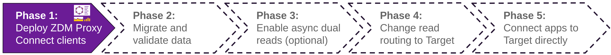

<!-- TOP -->
<div class="top">
  
  <div class="scenario-title-section">
    <span class="scenario-title">Zero Downtime Migration Lab</span>
    <span class="scenario-subtitle">ℹ️ For technical support, please contact us via <a href="mailto:aleksandr.volochnev@datastax.com">email</a> or <a href="https://dtsx.io/aleks">LinkedIn</a>.</span>
  </div>
</div>

<!-- NAVIGATION -->
<div id="navigation-top" class="navigation-top">
 <a href='command:katapod.loadPage?[{"step":"step3"}]' 
   class="btn btn-dark navigation-top-left">⬅️ Back
 </a>
<span class="step-count">Step 4</span>
 <a href='command:katapod.loadPage?[{"step":"step5"}]' 
    class="btn btn-dark navigation-top-right">Next ➡️
  </a>
</div>

<!-- CONTENT -->

<div class="step-title">Phase 1c: Start the proxy</div>



#### _🎯 Goal: configuring and starting the Ansible playbook that automates the creation and deployment of the ZDM Proxy on the target machine(s)._

First start a `bash` shell on the `zdm-ansible-container`: this
will be needed a few times in the rest of this lab
(and will be in the "zdm-ansible-console" terminal).
_The next command will result in the prompt changing to_
_something like `ubuntu@4fb20a9b:~$`:_
_this terminal will stay in the container until the end._

```bash
### container
docker exec -it zdm-ansible-container bash
```

It is time to configure the settings for the proxy that is
about to be created. To do so, you are going to edit
the file `zdm_proxy_core_config.yml` _on the container_,
adding connection parameters for both Origin and Target.

First check the IP address of the Cassandra node, with:

```bash
### host
. /workspace/zdm-scenario-katapod/scenario_scripts/find_addresses.sh
```

Moreover you'll need the Target database ID:
**if you went through the Astra CLI path**, your database ID is simply given by this command
(check this [link](https://awesome-astra.github.io/docs/pages/astra/faq/#where-should-i-find-a-database-identifier) if you used the **Astra UI** instead):

```bash
### host
grep ASTRA_DB_ID /workspace/zdm-scenario-katapod/.env
```

In file `zdm_proxy_core_config.yml`, you'll have to uncomment and edit the following entries:

- `origin_username` and `origin_password`: set both to "cassandra" (no quotes);
- `origin_contact_points`: set it to the IP of the Cassandra seed node (**Note: this is the value of `CASSANDRA_SEED_IP`, and _not_ the ZDM host address**);
- `origin_port`: set to 9042;
- `target_username` and `target_password`: set to Client ID and Client Secret found in your Astra DB Token;
- `target_astra_db_id` is your Database ID from the Astra DB dashboard;
- `target_astra_token` is the "token" string in your Astra DB Token" (the one starting with `AstraCS:...`).

_Within the container, all the file editing will have to be done in the console. To save and quit_
_`nano` when you are done, hit `Ctrl-X`, then `Y`, then `Enter`._

```bash
### container
cd /home/ubuntu/zdm-proxy-automation/
nano ansible/vars/zdm_proxy_core_config.yml
```

Once the changes are saved,
you can run the Ansible playbook that will provision and start the proxy containers in the proxy host: still in the Ansible container, launch the command:

```bash
### container
cd /home/ubuntu/zdm-proxy-automation/ansible
ansible-playbook deploy_zdm_proxy.yml -i zdm_ansible_inventory
```

This will provision, configure and start the ZDM Proxy, one container per instance
(in this exercise there'll be a single instance, `zdm-proxy-container`).
Once this is done, you can check the new container is listed in the output of

```bash
### host
docker ps
```

By inspecting the logs of the containerized proxy instance, you can verify that it has indeed
succeeded in connecting to the clusters:

```bash
### host
docker logs zdm-proxy-container 2>&1 | grep "Proxy connected"
```

Alternatively, the ZDM Proxy exposes a health-status HTTP endpoint:
you can query it with

```bash
. /workspace/zdm-scenario-katapod/scenario_scripts/find_addresses.sh
curl http://${ZDM_HOST_IP}:14001/health/readiness | jq
```

#### _🗒️ The ZDM Proxy is now up and running, ready to accept connections just as if it were a regular Cassandra cluster. But before re-routing the client application, let's think about observability!_

<!-- NAVIGATION -->
<div id="navigation-bottom" class="navigation-bottom">
 <a href='command:katapod.loadPage?[{"step":"step3"}]'
   class="btn btn-dark navigation-bottom-left">⬅️ Back
 </a>
 <a href='command:katapod.loadPage?[{"step":"step5"}]'
    class="btn btn-dark navigation-bottom-right">Next ➡️
  </a>
</div>
