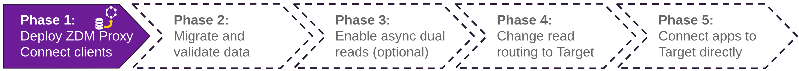

<!-- TOP -->
<div class="top">
  
  <div class="scenario-title-section">
    <span class="scenario-title">Zero Downtime Migration Lab</span>
    <span class="scenario-subtitle">ℹ️ For technical support, please contact us via <a href="mailto:aleksandr.volochnev@datastax.com">email</a> or <a href="https://dtsx.io/aleks">LinkedIn</a>.</span>
  </div>
</div>

<!-- NAVIGATION -->
<div id="navigation-top" class="navigation-top">
 <a href='command:katapod.loadPage?[{"step":"step4"}]' 
   class="btn btn-dark navigation-top-left">⬅️ Back
 </a>
<span class="step-count">Step 5</span>
 <a href='command:katapod.loadPage?[{"step":"step6"}]' 
    class="btn btn-dark navigation-top-right">Next ➡️
  </a>
</div>

<!-- CONTENT -->

<div class="step-title">Phase 1d: Start the monitoring stack</div>



#### _🎯 Goal: having the Ansible automation provision and start the monitoring stack associated to the ZDM Proxy._

The `zdm-ansible-container` also offers a playbook that installs and starts
a full monitoring stack, which will make Grafana dashboards available for
a detailed view of the performance of the proxy.

Edit file `zdm_monitoring_config.yml` and set the value of `grafana_admin_password` to a memorable password (leaving `grafana_admin_user` to its default of `admin`):

```bash
### container
cd /home/ubuntu/zdm-proxy-automation/ansible
nano +4,25 vars/zdm_monitoring_config.yml
```

You can now launch the playbook that sets up the monitoring stack:

```bash
### container
cd /home/ubuntu/zdm-proxy-automation/ansible
ansible-playbook deploy_zdm_monitoring.yml -i zdm_ansible_inventory
```

Once this has completed, there will be a Grafana instance
waiting for you. While generally it would be reached on port 3000 at
your monitoring instance's address, _within this learning environment_
you can directly open it in a new browser tab
by running the command:

```bash
### host
MONITORING_URL=`gp url 3000`
echo "Opening ${MONITORING_URL} ..."
gp preview --external ${MONITORING_URL}
```

_(Depending on your browser and popup-blocker settings, chances are no tab will open at this point. In that case, simply grab the URL output on your console and manually point a new tab to that address.)_

Log in with user `admin` and the password you chose,
then go to Dashboards/Manage and pick e.g.
the "ZDM Proxy Dashboard v1" to confirm the datapoints for the plots
are pouring in.

<details style="margin-bottom: 12px;"><summary>Click for instructions</summary>


</details>

#### _🗒️ You have just set up a tool to keep the functioning and performance of the proxy completely under control. The time has come to make your client application talk to the proxy!_

#### 🔎 Monitoring suggestion

**Please keep the dashboard open throughout the rest of this lab.**

For now, just scroll through the graphs in the dashboard
to familiarize yourself with it. You will inspect it more in detail
in the next steps.

<!-- NAVIGATION -->
<div id="navigation-bottom" class="navigation-bottom">
 <a href='command:katapod.loadPage?[{"step":"step4"}]'
   class="btn btn-dark navigation-bottom-left">⬅️ Back
 </a>
 <a href='command:katapod.loadPage?[{"step":"step6"}]'
    class="btn btn-dark navigation-bottom-right">Next ➡️
  </a>
</div>
