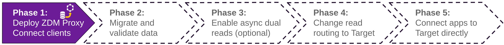
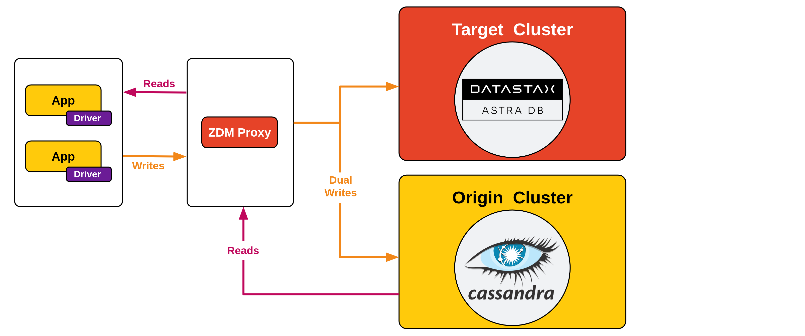

<!-- TOP -->
<div class="top">
  
  <div class="scenario-title-section">
    <span class="scenario-title">Zero Downtime Migration Lab</span>
    <span class="scenario-subtitle">ℹ️ For technical support, please contact us via <a href="mailto:aleksandr.volochnev@datastax.com">email</a> or <a href="https://dtsx.io/aleks">LinkedIn</a>.</span>
  </div>
</div>

<!-- NAVIGATION -->
<div id="navigation-top" class="navigation-top">
 <a href='command:katapod.loadPage?[{"step":"step5"}]' 
   class="btn btn-dark navigation-top-left">⬅️ Back
 </a>
<span class="step-count">Step 6</span>
 <a href='command:katapod.loadPage?[{"step":"step7"}]' 
    class="btn btn-dark navigation-top-right">Next ➡️
  </a>
</div>

<!-- CONTENT -->

<div class="step-title">Phase 1d: Connect the client application to the proxy</div>



#### _🎯 Goal: switching the client application from a direct connection to Origin to a connection through the proxy (while still keeping Origin as the primary DB)._

The sample client application used in this exercise is a simple FastAPI process:
we will have to stop it (killing the process running the API) and start it again
specifying a different connection mode.

Before doing that, however, let's finish writing the required settings in
the `.env` file. Check the full path of the secure-connect-bundle zipfile
you downloaded:

**if you went through the Astra CLI path**, do so with:

```bash
### logs
# locate the bundle zipfile (if Astra CLI setup followed)
grep ASTRA_DB_SECURE_BUNDLE_PATH /workspace/zdm-scenario-katapod/.env
```

**otherwise**, you can get the zipfile path by running:

```bash
### logs
# locate the bundle zipfile (if Astra Web UI setup followed)
ls /workspace/zdm-scenario-katapod/secure*zip
```

Get the IP address of the proxy instance as well:

```bash
### logs
. /workspace/zdm-scenario-katapod/scenario_scripts/find_addresses.sh
```

_(this time, the commands above will run and print their output on the still-unused
"zdm-proxy-logs" console for your convenience while editing the dot-env file.)_

and finally make sure you have the "Client ID" and the "Client Secret" found
in your Astra DB Token. Now you can insert the values of `ASTRA_DB_SECURE_BUNDLE_PATH`, `ASTRA_DB_CLIENT_ID`, `ASTRA_DB_CLIENT_SECRET` and `ZDM_HOST_IP`:

```bash
### host
nano +7,30 /workspace/zdm-scenario-katapod/client_application/.env
```

Once you save the changes (_Ctrl-X, then Y, then Enter in the `nano` editor_),
restart the API by executing the following, which kills the process in the "api-console" and launches it again:

```bash
### {"terminalId": "api", "macrosBefore": ["ctrl_c"]}
# A Ctrl-C to stop the running process ... followed by:
CLIENT_CONNECTION_MODE=ZDM_PROXY uvicorn api:app
```

This time, the API connects to the proxy. You should see no disruptions in the
requests that are running in the "api-client-console".

As a test, try sending manually a new status by issuing this request
on the "host-console":

```bash
### host
curl -XPOST localhost:8000/status/eva/ThroughZDMProxy | jq
```

and then by reading right after that:

```bash
### host
curl -XGET localhost:8000/status/eva | jq -r '.[].status'
```

The API is connecting to the ZDM Proxy. The proxy, in turn, is propagating
writes to _both_ the Origin and Target databases. To verify this,
check that you can read the last-inserted status rows from Origin:

```bash
### host
docker exec \
  -it cassandra-origin-1 \
  cqlsh -u cassandra -p cassandra \
  -e "SELECT * FROM zdmapp.user_status WHERE user='eva' limit 3;"
```

Likewise, you can do the same check on Target, i.e. Astra DB:
**if you went through the Astra CLI path**, you can run the following:

```bash
### host
astra db cqlsh zdmtarget \
  -k zdmapp \
  -e "SELECT * FROM zdmapp.user_status WHERE user='eva' limit 3;"
```

**otherwise**, paste this `SELECT` statement directly in the Astra DB Web CQL Console:

```cql
### {"execute": false}
SELECT * FROM zdmapp.user_status WHERE user='eva' limit 3;
```

Note that rows inserted before this switch are **not present** on Target.
To remedy this shortcoming, you must do something more.

#### _🗒️ The proxy is doing its job: in order to guarantee that the two databases have the same content, including historical data, it's time to run a migration process._



#### 🔎 Monitoring suggestion

The proxy is now routing actual traffic, and this will be reflected on the
dashboard _(note that the metrics take a few seconds to be reflected on graphs)_.
The instance-level metrics, which refer to an individual proxy instance,
show the read operations as they are issued with the `curl` GETs above,
as well as the regular writes sent in by the running loop.
You can also look at the read/write latency graphs and at the number of client connections.

The node-level metrics (further down in the dashboard) refer to Origin and Target:
with those graphs, you can confirm that writes are indeed going to both clusters,
while reads only go to Origin.

<!-- NAVIGATION -->
<div id="navigation-bottom" class="navigation-bottom">
 <a href='command:katapod.loadPage?[{"step":"step5"}]'
   class="btn btn-dark navigation-bottom-left">⬅️ Back
 </a>
 <a href='command:katapod.loadPage?[{"step":"step7"}]'
    class="btn btn-dark navigation-bottom-right">Next ➡️
  </a>
</div>
