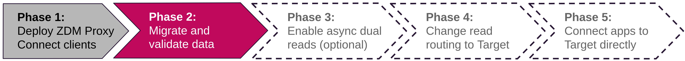
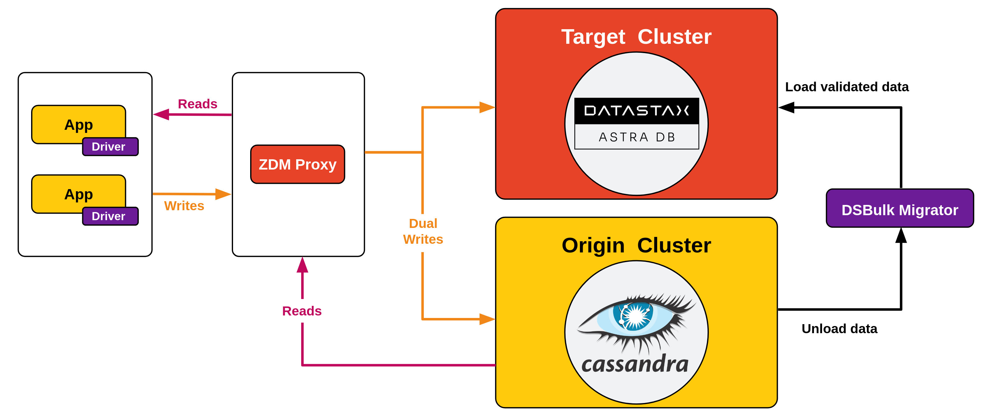

<!-- TOP -->
<div class="top">
  
  <div class="scenario-title-section">
    <span class="scenario-title">Zero Downtime Migration Lab</span>
    <span class="scenario-subtitle">ℹ️ For technical support, please contact us via <a href="mailto:academy@datastax.com">email</a>.</span>
  </div>
</div>

<!-- NAVIGATION -->
<div id="navigation-top" class="navigation-top">
 <a href='command:katapod.loadPage?[{"step":"step6"}]' 
   class="btn btn-dark navigation-top-left">⬅️ Back
 </a>
<span class="step-count">Step 7</span>
 <a href='command:katapod.loadPage?[{"step":"step8"}]' 
    class="btn btn-dark navigation-top-right">Next ➡️
  </a>
</div>

<!-- CONTENT -->

<div class="step-title">Phase 2: migrate data</div>



#### _🎯 Goal: ensuring historical data, inserted before the introduction of the ZDM Proxy, is present on the Target database._

In order to completely migrate to Target, you must take care
of the _whole_ contents of the database. To this end,
you will now download, build and launch [DSBulk Migrator](https://github.com/datastax/dsbulk-migrator#readme)
(a tool which, in turn, leverages the capabilities of [DSBulk](https://github.com/datastax/dsbulk#readme)).

_Note: since the data featured in this exercise is rather small, and the data
migration itself is not the main topic of this exercise, we are not using "Cassandra Data Migrator" here. But if you need advanced data renconciliation features, or you
are dealing with a database exceeding a few tens of GB, that might be your best option._

Verify that the entries inserted before the switch to using the ZDM Proxy are **not** found on Target.
To do so, **if you went through the Astra CLI path**, launch this command _(editing the database name if different from `zdmtarget`)_:

```bash
### host
astra db cqlsh zdmtarget \
  -k zdmapp \
  -e "SELECT * FROM zdmapp.user_status WHERE user='eva' limit 30;"
```

or, **if you used the Astra UI**, go to the Web CQL Console and run the statement:

```cql
### {"execute": false}
SELECT * FROM zdmapp.user_status WHERE user='eva' limit 30;
```

You should see just the few rows written once you restarted the API to take advantage of the ZDM Proxy.

Start the migration process by going to the `migration` directory and obtain the source
code for DSBulk Migrator:

```bash
### {"terminalId": "host", "backgroundColor": "#C5DDD2"}
cd /workspace/zdm-scenario-katapod/migration/
git clone https://github.com/datastax/dsbulk-migrator.git
cd dsbulk-migrator/
# we pin a commit just to make sure the (versioned) jar name matches later on:
git checkout 9b8a3759d3b59bcbcea191164d791ec8adc83ce9
```

Build the project with (this may take 1-2 minutes):

```bash
### {"terminalId": "host", "backgroundColor": "#C5DDD2"}
cd /workspace/zdm-scenario-katapod/migration/dsbulk-migrator/
mvn clean package
```

You can now start the migration, providing the necessary connection and
schema information (the "export cluster" will be Origin and the
"import cluster" will be Astra DB). To make this process easier, the
following commands read the required connection settings also from the dot-env
file you already set up for the client application:

```bash
### {"terminalId": "host", "backgroundColor": "#C5DDD2"}
cd /workspace/zdm-scenario-katapod/migration/dsbulk-migrator/
. /workspace/zdm-scenario-katapod/scenario_scripts/find_addresses.sh
. /workspace/zdm-scenario-katapod/client_application/.env

java -jar target/dsbulk-migrator-1.0.0-SNAPSHOT-embedded-dsbulk.jar \
  migrate-live \
  -e \
  --keyspaces=zdmapp \
  --export-host=${CASSANDRA_SEED_IP} \
  --export-username=cassandra \
  --export-password=cassandra \
  --import-username=${ASTRA_DB_CLIENT_ID} \
  --import-password=${ASTRA_DB_CLIENT_SECRET} \
  --import-bundle=${ASTRA_DB_SECURE_BUNDLE_PATH}
```

Once this command has completed, you will see that now _all_ rows are
on Target as well, including those written prior to setting up
the ZDM Proxy.

To verify this,
**if you went through the Astra CLI path**, launch this command _(editing the database name if different from `zdmtarget`)_:

```bash
### host
astra db cqlsh zdmtarget \
  -k zdmapp \
  -e "SELECT * FROM zdmapp.user_status WHERE user='eva' limit 30;"
```

or, **if you used the Astra UI**, go to the Web CQL Console and run the statement:

```cql
### {"execute": false}
SELECT * FROM zdmapp.user_status WHERE user='eva' limit 30;
```

From this moment on, the data on Target will not diverge from Origin
until the moment you decide to cut over and neglect Origin altogether.

#### _🗒️ At this point, you might wonder whether Target is actually capable of sustaining the read workload your applications demand. Well, the perfect way to address this concern is to have the proxy perform asynchronous dual reads on it. Read on to find out._



#### 🔎 Monitoring suggestion

Since the data migrator connects **directly to Origin and Target, oblivious to
the ZDM Proxy**, the migration workload will not be reflected in the monitoring.
You can confirm this by looking at the proxy instance graphs, which will show
no read activity and the usual background write activity.
In other words, the data migration occurs outside of the proxy's scope,
hence will not be part of the metrics collected in the Grafana dashboard.

<!-- NAVIGATION -->
<div id="navigation-bottom" class="navigation-bottom">
 <a href='command:katapod.loadPage?[{"step":"step6"}]'
   class="btn btn-dark navigation-bottom-left">⬅️ Back
 </a>
 <a href='command:katapod.loadPage?[{"step":"step8"}]'
    class="btn btn-dark navigation-bottom-right">Next ➡️
  </a>
</div>
