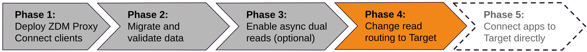

<!-- TOP -->
<div class="top">
  
  <div class="scenario-title-section">
    <span class="scenario-title">Zero Downtime Migration Lab</span>
    <span class="scenario-subtitle">ℹ️ For technical support, please contact us via <a href="mailto:aleksandr.volochnev@datastax.com">email</a> or <a href="https://dtsx.io/aleks">LinkedIn</a>.</span>
  </div>
</div>

<!-- NAVIGATION -->
<div id="navigation-top" class="navigation-top">
 <a href='command:katapod.loadPage?[{"step":"step8"}]' 
   class="btn btn-dark navigation-top-left">⬅️ Back
 </a>
<span class="step-count">Step 9</span>
 <a href='command:katapod.loadPage?[{"step":"step10"}]' 
    class="btn btn-dark navigation-top-right">Next ➡️
  </a>
</div>

<!-- CONTENT -->

<div class="step-title">Phase 4: change read routing to Target</div>



#### _🎯 Goal: setting Target as primary database, so that the ZDM proxy will serve the data read from it to connected clients._

At this point, you have ensured that your Target database is able to handle
the read load and you are happy with its tuning.
It is now time to disable asynchronous read routing and
switch all synchronous reads to Target.

This step is very similar from the previous one: first
edit the `zdm_proxy_core_config.yml` settings again:

- change the value of `primary_cluster` from
`ORIGIN` to `TARGET`;
- revert `read_mode` back to `PRIMARY_ONLY` (which will now mean Target):

```bash
### container
cd /home/ubuntu/zdm-proxy-automation/ansible
nano vars/zdm_proxy_core_config.yml
```

Once you save and exit the editor, you can issue another
"rolling update" to propagate the new configuration
to the proxy(/proxies):

```bash
### container
ansible-playbook rolling_update_zdm_proxy.yml -i zdm_ansible_inventory
```

Again, the logs will stop and will need to be restarted shortly after launching
the command above:

```bash
### {"terminalId": "logs", "macrosBefore": ["ctrl_c"]}
# A Ctrl-C to stop the logs (in case they're still running) ...
# Then we start them again:
docker logs -f zdm-proxy-container
```

And again, you can look for a long line being written in the logs that
confirms the new setting having taken effect.

At this point, Target is the functioning primary, with Origin still being kept completely up to date.
For a proof, you can launch a manual write through the API:

```bash
### host
curl -XPOST localhost:8000/status/eva/TargetIsPrimary | jq
```

and then try reading the recent rows from both databases. For Origin:

```bash
### host
docker exec \
  -it cassandra-origin-1 \
  cqlsh -u cassandra -p cassandra \
  -e "SELECT * FROM zdmapp.user_status WHERE user='eva' limit 3;"
```

For Target, **if you went through the Astra CLI path**, launch the following:

```bash
### host
astra db cqlsh zdmtarget \
  -k zdmapp \
  -e "SELECT * FROM zdmapp.user_status WHERE user='eva' limit 3;"
```

**otherwise**, paste this in the Astra DB CQL Web Console:

```cql
### {"execute": false}
SELECT * FROM zdmapp.user_status WHERE user='eva' limit 3;
```

#### _🗒️ You are almost at the end of this migration journey. The only missing step is to ... abandon the proxy altogether, writing directly to Target. Keep reading to do just that._


<!-- NAVIGATION -->
<div id="navigation-bottom" class="navigation-bottom">
 <a href='command:katapod.loadPage?[{"step":"step8"}]'
   class="btn btn-dark navigation-bottom-left">⬅️ Back
 </a>
 <a href='command:katapod.loadPage?[{"step":"step10"}]'
    class="btn btn-dark navigation-bottom-right">Next ➡️
  </a>
</div>
